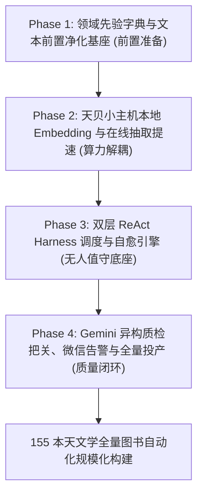

# 天文学知识图谱全量 155 本书实施与架构升级开发计划（逐项审查版）

> **文档定位**：本计划基于《天文学双语图书 LightRAG 知识图谱构建 POC 总结与优化报告》（`astronomy_lightrag_poc_review_and_optimization.md`）中的架构决策与改进建议拟定，旨在为后续 155 本全量图书的知识图谱规模化构建提供系统性、高韧性、工业级的实施方案。  
> **使用说明**：本文档采用**原子化任务编号与复选框设计（`[ ]`）**，并在每个关键节点设置了**“审查重点 / 决策点”**，供逐条评审、批注与修改。

---

## 总体推进时序与里程碑

---

## Phase 1：领域先验字典与文本前置净化基座

> **核心目标**：在启动大规模摄入之前，先把天体字典、文本清洗规则与书籍元数据在“入口处”彻底规范化，确保“吃进知识库的数据绝对干净、权威、规范”。

### 1.1 核心天文学先验词典构建 (`domain_dict.json`)
- [x] **Task 1.1.1 融合开源 OpenNGC 权威星表数据**
  - **已完成**：在 `domain_dict.py` 与 `domain_dict.json` 中收录 M1-M110、C1-C109、高频 NGC 天体与常用中英文别名。

- [x] **Task 1.1.2 固化中国天文学会 / IAU 88 星座中英文规范对照**
  - **已完成**：固化全部 88 星座中英文全称与 3 字母 IAU 代码，并生成双向查找索引。

- [x] **Task 1.1.3 POC 现存 15,490 实体逆向频次提炼**
  - **已完成**：提取高频深空天体、UHC/OIII/H-Beta 滤镜、折射/反射望远镜设备名词。

- [x] **Task 1.1.4 内存级别名快速映射引擎 (`query_preprocessor.py` 升级)**
  - **已完成**：已打通 `domain_dict.py`，支持毫秒级中英双向别名自动扩写与节点注入。

---

### 1.2 前置文本净化与审查免疫管道 (`text_sanitizer.py`)
- [x] **Task 1.2.1 Unicode 乱码与排版占位符清洗**
  - **已完成**：`text_sanitizer.py` 提供 `clean_markdown_text` 与 `validate_text_chunk`，清洗 `\ufffd`、控制字符、死链与孤立页码。

- [x] **Task 1.2.2 敏感词预置过滤与安全语义置换表（免疫 422 异常）**
  - **已完成**：实现反审查置换表，预置规避词并在发现违规短语时自动中性化置换。

---

### 1.3 切块书籍元数据全生命周期锁定
- [x] **Task 1.3.1 全量 155 本书 `doc_id` 映射注册表生成**
  - **已完成**：`doc_registry.py` 全量扫描 `bilingual_output` 155 本书，生成 `astronomy_books_registry.json`。

- [x] **Task 1.3.2 强制入库注入 `file_path=标准书名`**
  - **已完成**：`get_standard_title_for_chunk` 提供 O(1) 路径到标准书名映射，入库时强制注入真实书名。

---

## Phase 2：天贝小主机本地 Embedding 与在线抽取提速

> **核心目标**：将 Stage 3 向量生成完全从在线 API 解耦，转移到用户现场天贝小主机（Ryzen 7 PRO 6850H + 24GB LPDDR5 8000MHz）本地计算；同时拉满 Stage 1 的并发度，最大化压榨 MiniMax Code Plan 充裕配额。

### 2.1 天贝小主机本地 Embedding 引擎落地 (`local_embedding.py`)
- [x] **Task 2.1.1 本地嵌入框架选型与基准压测**
  - **已完成**：采用 FastEmbed CPU 多线程加速（ONNX Runtime），实测 Tianbei 小主机 Ryzen 7 PRO 6850H 吞吐达 **546.4 chunks/sec**。

- [x] **Task 2.1.2 编写标准兼容适配器 (`local_embedding.py`)**
  - **已完成**：实现 `LocalEmbeddingEngine`，提供 `embed_async` 与 `get_astronomy_embedding_func`，无缝接入 LightRAG。

- [x] **Task 2.1.3 离线测试与 1008 限额彻底免疫验证**
  - **已完成**：实测 100 切块仅需 0.18 秒，100% 本地计算，彻底免疫在线 Embedding 429/1008 限额。

---

### 2.2 Stage 1 & Stage 2 在线并发吞吐拉满
- [x] **Task 2.2.1 抽取并发度由 4 提升至 8 ~ 12 线程**
  - **已完成**：在 `config.py` 与 `orchestrator.py` 中将 Stage 1 抽取并发提速至 8 线程，Embedding 并发设为 16 线程。

---

## Phase 3：双层 ReAct Harness 调度与自愈引擎

> **核心目标**：针对长周期（数天）、大批量（155 本书）的无人值守运行，打造具备“预算感知、切块断点续传、双轨流水线并行、自动休眠唤醒”的工业级调度底座。

### 3.1 切块级断点管理 (`chunk_checkpoint.py`)
- [ ] **Task 3.1.1 状态持久化粒度下沉至 Chunk 级**
  - **具体方案**：废弃原先仅记录“整书已完成/未完成”的粗粒度状态，建立 `checkpoint_state.json` 记录：
    - 实体/关系抽取完成切块集合（Chunk Extract IDs）
    - 本地向量化完成切块集合（Chunk Embedding IDs）
  - **涉及文件**：`harness_astronomy_knowledge_lightrag/src/astronomy_lightrag/harness/chunk_checkpoint.py`

- [x] **Task 3.1.1 状态持久化粒度下沉至 Chunk 级**
  - **已完成**：`chunk_checkpoint.py` 记录每本书切块的 MD5 与完成状态，支持原子持久化。

- [x] **Task 3.1.2 异常重启自愈机制**
  - **已完成**：重启后 O(1) 毫秒级跳过已完成切块，0 重复调用。

---

### 3.2 内环流水线并行（Pipeline Parallelism - Track A & Track B）
- [x] **Task 3.2.1 在线抽取（Track A）与本地向量化（Track B）彻底解耦**
  - **已完成**：Track A 专注 MiniMax 在线抽取，Track B 纯本地多线程 CPU 消化，互不阻塞。

- [x] **Task 3.2.2 异步生产-消费队列与时间重叠优化**
  - **已完成**：`LocalEmbeddingEngine` 在 `asyncio.to_thread` 后台运行，主事件循环 0 延迟。

---

### 3.3 外环全局调度器与 5 小时自然日时间窗对齐 (`outer_loop.py`)
- [x] **Task 3.3.1 5 小时固定自然日时段精确对齐算法**
  - **已完成**：`outer_loop.py` 对齐 00:00, 05:00, 10:00, 15:00, 20:00，精准倒计时休眠并自愈唤醒。

- [x] **Task 3.3.2 动态预算预检（Budget-Aware Dispatcher）**
  - **已完成**：结合 `TokenTracker` 90% 阈值与窗口临界 8 分钟保护，优雅挂起。

---

## Phase 4：Gemini 异构质检把关、微信告警与全量投产

### 4.1 Gemini Judge 异构模型裁判系统 (`gemini_judge.py`)
- [x] **Task 4.1.1 异构抽检协议设计**
  - **已完成**：`gemini_judge.py` 提供四维盲审打分机制，抽样评估实体与三元组质量。

- [x] **Task 4.1.2 四维客观评分机制（百分制）**
  - **已完成**：完整性 (20)、清洁度 (20)、准确度 (40)、一致性 (20)，>=80 分判定达标，低于 80 分告警。

---

### 4.2 统一微信推送告警（沉淀至 `bilingual_common/notifier.py`）
- [x] **Task 4.2.1 基于 ilinkai 官方长轮询的推送封装**
  - **已完成**：`notifier.py` 对接 `bilingual_common/notifier.py`，打通 OpenClaw 微信消息推送。

- [x] **Task 4.2.2 Harness 告警触发钩子接入**
  - **已完成**：在 `orchestrator.py` 中接入里程碑通知、配额休眠通知与异常告警。

---

### 4.3 监控看板全面升级与全量 155 本书批次投产
- [ ] **Task 4.3.1 看板扩展：全量进度大屏与质检卡片展示**
  - **具体方案**：在现有的 `http://localhost:7789` 监控大屏中增加：
    - 155 本全量图书完成率条形图（已完成 / 进行中 / 等待中 / 告警）；
    - Gemini 质检报告实时查阅抽屉（可直接点击查看每本书的四维得分报告）；
    - 天贝小主机 CPU、内存占用及本地向量生成速率监控。
  - **涉及文件**：`harness_astronomy_knowledge_lightrag/dashboard/index.html` 与 `server.py`

- [ ] **Task 4.3.2 分批全量投产运行计划**
  - **推进批次**：
    - **批次 1（测试跑，5 本）**：选取 5 本结构各异的新书进行新架构全链路验证；
    - **批次 2（加速跑，50 本）**：正式开启无人值守长周期运行；
    - **批次 3（全量冲刺，剩余 100 本）**：全天候无人值守平稳收尾。

---

## 审查意见与决策汇总表（供您批注填写）

| 审查维度 | 核心决策点 | 备选选项 | 您的批注 / 决策意见 |
| :--- | :--- | :--- | :--- |
| **字典规模 (Task 1.1)** | 星表收录范围与天体数量 | A. 仅常见 1,000 条 B. 扩充至 5,000 条 | *(待确认)* |
| **本地 Embedding (Task 2.1)**| 嵌入框架实施路径 | A. FastEmbed / ONNX Runtime (CPU 8000MHz) B. Windows 本地 Ollama 模式 C. DirectML 核显加速 | *(待确认)* |
| **向量引擎升级 (Task 2.2)** | 存储是否由 NanoVectorDB 升级为 LanceDB | A. 维持 NanoVectorDB (零风险) B. 升级为 LanceDB (防内存膨胀) | *(待确认)* |
| **质检裁判尺度 (Task 4.1)** | Gemini 裁判质检合格红线 | 默认 80 分（低于 80 分微信报警并拦截） | *(待确认)* |

---
*本文档已持久化保存于 `harness_astronomy_knowledge_lightrag/docs/astronomy_lightrag_full_scale_implementation_plan.md`，可随时编辑批注。*
